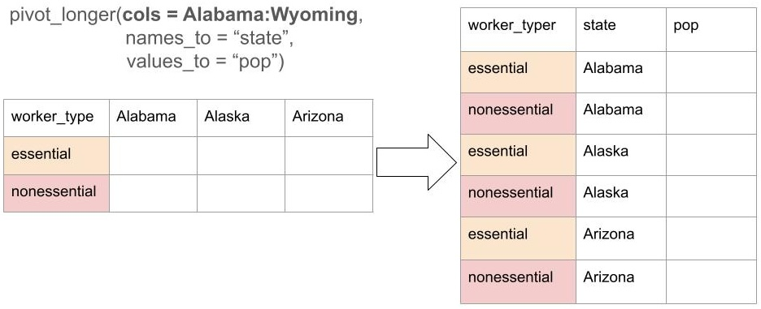
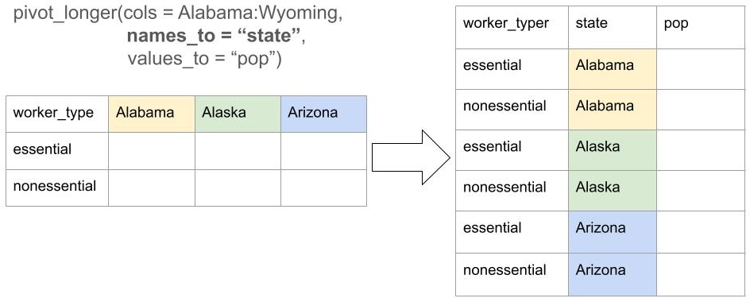
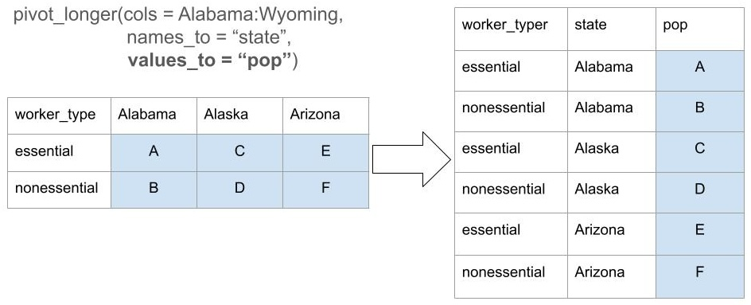
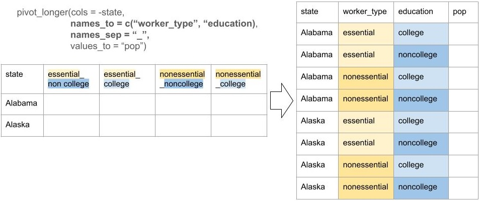
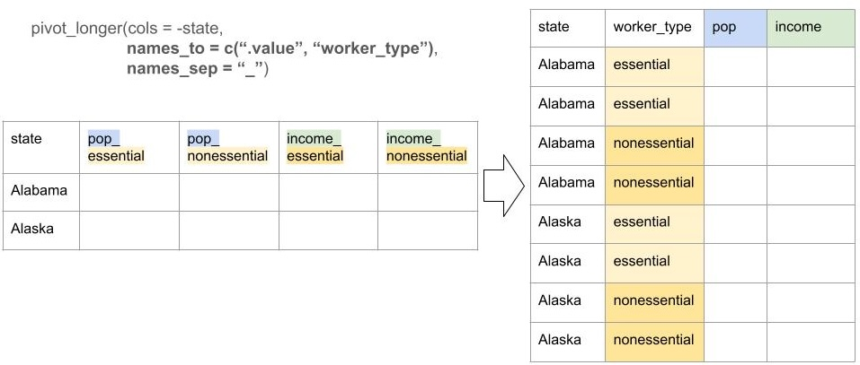

# D-Lab: R Data Wrangling - Part 2

## Learning Objectives

Welcome to Part 2 of R Data Wrangling. Our learning objectives for this two part workshop are:

1.  Learn the `tidyverse` functions for **transforming** your data to be used for visualization and analysis

2.  Identify how an "untidy" dataframes gets in the way of data visualization and analysis

3.  Learn the `tidyverse` functions used to **wrangle** a dataframe into "tidy" form

Always remember the [D-Lab](https://dlab.berkeley.edu/home) moto: It's Okay Not to Know!

Throughout this workshop series, we will use the following icons:

🔔 **Question**: A quick question to help you understand what's going on.

🥊 **Challenge**: Interactive exercise. We'll go through these in the workshop!

⚠️ **Warning**: Heads-up about tricky stuff or common mistakes.

💡 **Tip**: How to do something a bit more efficiently or effectively.

📝 **Poll**: A zoom poll to help you learn.

🎬 **Demo**: Showing off something more advanced so you know what you can use R for in the future.

# Part 1 recap - transforming data

In Part 1, we focused on learning objective #1: transforming our data to answer questions about the data. We used multiple functions from the `tidyverse` package such as `group_by()`, `mutate()`, and `summarize()`.

💡 **Tip**: Refer back to the Part 1 notebook to see examples of these functions.

Let's read in the data that we created at the end of Part 1. We aggregated person level data from the American Community Survey to the state and worker type level. For each state (`stname`) and type of worker (`worker_type`) we have the number of people (`pop`), the average income (`income`), and the share with a college degree (`college`).

```{r}
# load in tidyverse
library(tidyverse)

d <- readRDS("../data/part2_data.rds")
head(d)

```

📝 **Poll** **R-Data 2-1:** What makes this data tidy? Answer in the poll by selecting all statements that apply.

## 🥊 Challenge 1: Using `tidyverse` functions on tidy data

Which state has the largest share of essential workers (`worker_type` == "essential")? Use the following functions we learned in Part 1: `group_by()`, `mutate()`, `filter()` and `arrange()`.

💡 **Tip**: Before starting to code, write down what additional variable(s) you will need to create and how you will create them.

```{r}


```

# Messy Data

Having our data in tidy form made it possible to answer the question above about share of workers because we could apply to functions `mutate()` and `group_by()` without changing anything about our data.

But data often comes to us in different formats. This could be because it has been gathered in a specific way or because it is more readable to present it in non-tidy form. For example, here is the same data but presented differently.

```{r}
d_ex1 <- readRDS("../data/part2_data_wide_1.rds")
head(d_ex1)
```

🔔 **Question**: What is different about this dataset? Is there one row per observation and one column per variable? If not, how would you describe it?

Having data in non-tidy form makes analysis and data visualization harder. Lets say we want to ask the same question, which state has the largest share of essential workers? First, we need to calculate the total state population.

🔔 **Question**: Can you think of a way to use the `tidyverse` functions to get the total state population? If not, can you explain in words what you would try to do to get the state population?

Asking questions of our data becomes tricky when the data is not in tidy form. In this part of the workshop, we will learn different functions for transforming our data into tidy form.

## 🎬 Demo: Wrangling messy data

In order to answer the question, which state has the largest share of essential workers, we need an additional first step: **data wrangling**. This means transforming our data from a messy format to a tidy format. By the end of today's workshop, you will be able to do this!

```{r}
d_tidy <- d_ex1 |>
  # wrangle the data into format of one person per row and one variable per column
  pivot_longer(cols = c(Alabama:Wyoming),
               names_to = "stname",
               values_to = "pop") |>
  select(stname, worker_type, pop) |>
  arrange(stname, worker_type)

# check how our new data looks
head(d_tidy)

# use the tidy data to answer the original question in the same way as in challenge #1 
d_tidy |>
  group_by(stname) |>
  mutate(state_pop = sum(pop),
         pct_worker_type = pop/state_pop) |>
  filter(worker_type == "essential") |>
  arrange(pct_worker_type)
               
```

## Game Plan

> "Tidy datasets are all alike, but every messy dataset is messy in its own way."\
> --- Hadley Wickham (and Leo Tolstoy)

Not all messy data is messy for the same reason. For example, `d_ex1` is messy because not every observation is a row and because we have column names that contain variable values.

```{r}
head(d_ex1)
```

🔔 **Question**: Looking at another dataframe that contains the same information, why is this one messy?

```{r}
d_ex2 <- readRDS("../data/part2_data_wide_2.rds")
head(d_ex2)
```

Because datasets can be messy in different ways, we will need multiple approaches to wrangling them into tidy form. Each time we see a new messy dataset in this workshop (and beyond!), we will ask three questions:

1.  Why is the dataset not tidy? Is there one observation per row? Is there one variable per column?

2.  What would the tidy version of this dataset look like? What would the rows be? What would the columns be?

    **💡 Tip:** It often helps to draw what the tidy dataset would look like on paper.

3.  What function(s) will wrangle the data into tidy form?

We can answer questions 1 and 2 now for most datasets. Question 3 we will be able to answer at the end of this workshop.

# Lengthening Data

Two common tools for tidying data are **lengthening** and **widening** data. Together they are referred to as **reshaping** data. We will start with lengthening, which means increasing the number of rows and/or decreasing the number of columns. If the answer to question 1 is, there are multiple observations per row, or, columns names contain information other than variable names, then we probably need to lengthen our data.

**⚠️ Warning:** Throughout the examples we will refer to the messy dataframe we start with as the **original** data and the tidy dataframe we are getting to as the **reshaped** data. This is to be consistent with the language you will see in help files or online.

## Data in column names

```{r}
head(d_ex1)
```

Looking at our original dataset, we can be more specific about the problems:

-   the column **names** are one variable: `state`

-   the column **values** are another variable: `population`

Goal: make each of the two variables (`state` and `population`) there own columns.

💡 **Tip**: We've answered the first two questions. At this point, it is helpful to sketch out what your reshaped data will look like with each of the column names.

We will now create the reshaped dataframe by using the function `pivot_longer()`. We can generally think of `pivot_longer()` as taking multiple columns in our original dataset and condensing or "gathering" them into two new columns: one containing the **names** of the original columns and one containing the **values** of the original columns. `pivot_longer()` has three arguments that are most commonly used:

1.  `cols`: the columns in our original dataframe that we want to gather into two new columns
2.  `names_to`: the name of the **new** column that will have the column **names** of the columns in `cols`
3.  `values_to`: the name of the **new** column that will have the column **values** of the columns in `cols`

📝 **Poll** **R-Data 2-2:** Looking at our dataset `d_ex1`, which columns should we provide to the `cols` argument inside `pivot_longer()`? Answer in the poll.

```{r}

d_tidy1 <- d_ex1 |>
  pivot_longer(cols = Alabama:Wyoming, #NB: you can use any tidyselect functions rather than typing out all the column names
               names_to = "state_name", #NB: this needs to be a string b/c it is a new column
               values_to = "pop") 

head(d_tidy1, n = 20)

```

Lets walk through what just happened. We kept the `worker_type` column because this wasn't included in the `cols` argument.



The column **names** from our original dataframe became the **values** of a new column created by the `names_to` argument that we called "state".



The column **values** from our original dataframe became the **values** of a new column created by the `values_to` argument that we called "pop".



💡 **Tip**: A good way to check if `pivot_longer()` has worked the way we wanted it to is to compare the number of rows in the original dataframe to the number of rows in the reshaped dataframe.

```{r}
# number of rows and columns before the pivot
dim(d_ex1)
```

```{r}
# number of rows and columns after the pivot
dim(d_tidy1)
```

🔔 **Question**: Why do we now have 153 rows and 3 columns, whereas before we had 3 rows and 52 columns?

## 🥊 Challenge 2: pivot_longer()

`d_ex2` is messy in a similar way to `d_ex1`. Answer the three questions about `d_ex2`:

1.  Why is the dataset not tidy? Is there one observation per row? Is there one variable per column?

2.  What would the tidy version of this dataset look like? What would the rows be? What would the columns be?

3.  What function(s) will wrangle the data into tidy form?

Now use `pivot_longer()` to wrangle `d_ex2` into tidy form. Check the pivot has worked as expected by looking at the number of rows and columns before and after.

💡 **Tip**: the reshaped dataframe should be identical to `d_tidy1`.

```{r}

# fill in your code for pivoting d_ex2 into tidy form 
d_tidy2 <- d_ex2 |>
  # YOUR CODE HERE

```

## Multiple types of data in column names

In the first two examples, the original dateframes had column names that contained **values** from a variable (state names in one and different types of workers in the other). In the next example, our column names contain **values** from *multiple* variables.

```{r}

d_ex3 <- readRDS("../data/part2_data_wide_3.rds")
head(d_ex3)

```

📝 **Poll R-Data 2-3**: Which statements explain why `d_ex3` isn't in tidy form? Select all that apply in the poll.

🔔 **Question**: What should the tidy version of this look like? What are each of the variables?

Having answered questions 1 and 2, we now address question 3: what function will wrangle the data into tidy form? Because we are adding rows and removing columns, we will use `pivot_longer()`.

In the example above, we wanted to gather our columns into **two** new variables: one for the column names and one for the column values. Now that the column names contained values from multiple variables, we want to create **three** new variables: **two** for the column names (`worker_type` and `education`) and one for the column values (`pop`).

```{r}

# pipe the data into pivot_longer()
d_tidy3 <- d_ex3 |>
  # we want to pivot all columns *except* stname so we can use the - to unselect this one
  pivot_longer(cols = -stname, 
               # these are the new variables that we create from the old column names
               names_to = c("worker_type", "education"), 
               # b/c there are multiple variables in the column names, we need to tell R how to distinguish between them
               names_sep = "_", 
               # this is the new variable that will store the cell values
               values_to = "pop") 

```

The column **names** from our original dataframe became the **values** of a **two** new column created by the `names_to` argument that we called "worker_type" and "education".



🔔 **Question**: How did R know which part of the column names from the original dataframe to put in the `worker_type` variable and which part to put in the `education` variable?

# Break Time ☕

# Widening Data

`pivot_longer()` is mostly used to reshape data into tidy form so that we can more easily answer questions with `tidyverse` functions or make plots using `ggplot`.

⚠️ **Warning**: While the tidy data framework is helpful it is not always the case that you will want your data in this format.

For example, what if we want to know the income difference between essential and non-essential workers by state?

```{r}
head(d)
```

Looking at our tidy data, instead of having one column for `worker_type` and one column for `income`, it would be more helpful to have two columns, one with the income of essential workers and one with the income of non-essential workers. Then we could subtract the columns from each other and have the income-difference between essential and non-essential workers.

To do this we will be decreasing the number of rows and increasing the number of columns. We can do this with the function `pivot_wider()`. It looks similar to `pivot_longer()` but takes different arguments:

1.  `id_cols`: the column(s) in the original dataframe that uniquely identify the rows we want in the reshaped data

2.  `names_from`: the variable in the original data that contains the **names** for the new columns in the reshaped data

3.  `values_from`: the variable in the original data that contains the **values** for the new columns in the reshaped data

```{r}
d_wide <- d |>
  pivot_wider(id_cols = stname,
              names_from = worker_type,
              values_from = income)

head(d_wide)

```

💡 **Tip**: In `pivot_longer()` we provided strings to the arguments because they were the names of **new** columns. In `pivot_wider()` we don't need to provide strings because we are referencing **existing** columns.

Always ask yourself, **what format can I wrangle my data into that makes it most easy to answer the questions I am asking?** Even though the new data isn't in tidy form, it is more helpful to answer the question, what is the income difference between essential and non-essential workers?

```{r}

# calculate the difference in income between essential and non-essential workers
d_wide |>
  mutate(income_diff = nonessential-essential) |>
  arrange(desc(income_diff))

```

## 🥊 Challenge 3: pivot_wider()

Which state has the largest difference between non-essential and essential workers in the share of people with college degrees? Which state as the smallest?

How does this compare to the ranking of states based on income difference between non-essential and essential workers?

Use `pivot_wider()` to reshape `d` into wider format that will help you answer this question. Then use functions from tidyverse to calculate the difference in college share between non-essential and essential workers.

```{r}
 
# YOUR CODE HERE


```

**🥊 Additional Challenge:** how can you adapt the code for pivot_wider() so that you can have in one dataframe both the income difference and the share with a college degree difference between essential and non-essential workers?

```{r}

# YOUR CODE HERE
```

# Multiple Data Frames

Until now, we have had a single data frame to work with. It can also be the case that you have multiple data frames that you want to combine. For example, we might have data on the state population in one data frame and information about the number of essential workers in another. To calculate the share of essential workers, we will need to combine these.

```{r}
# data on state population - doesn't include DC
d_pop <- readRDS("../data/part2_data_join_1.rds")
head(d_pop)
dim(d_pop)

# data on number of essential workers - only continental US, includes DC but not Hawaii or Alaska
d_worker <- readRDS("../data/part2_data_join_2.rds")
head(d_worker)
dim(d_worker)

```

To join two dataframes, we will perform an **outer join** using the `tidyverse` functions `left_join()`, `right_join()` and `full_join()`. All these functions have the same inputs:

-   `x`: dataframe A you want to join

-   `y`: dataframe B you want to join

-   `by`: the name of a variable (or vector of multiple variables) that is the *same* in both `x` and `y` and will be used to match the **rows** in `y` to the **rows** in `x`

🔔 **Question**: Looking at the variables in `d_pop` and `d_worker`, what variable should we supply to `by`?

⚠️ **Warning**: To join on a variable the *values* of that variable need to be the same in both datasets. If joining on a string variable, like `stname`, this means that any differences in spelling *or case* will not be matched together. For example "D.C." would *not* match to "DC".

We will start with `full_join()` - this will take dataset `x` and match it with all common rows in dataset `y` and keep *all* observations in `x` and `y`, even if they are not present in both datasets.

```{r}
# join d_pop and d_worker
d_join_full <- full_join(x = d_pop,
                    y = d_worker,
                    by = "stname") # this is a string of the variable name

head(d_join_full)
dim(d_join_full)
```

🔔 **Question**: Why are there 51 rows in `d_join_full` even though there are 50 rows in `d_pop` and 49 rows in `d_worker`?

Exploring `d_join_full`, we will see missing values in the columns and rows that are not common across both dataframes.

```{r}
View(d_join_full)
```

Here is a diagram of what we just did:


💡 **Tip**: Before doing a join, always think through how many rows and columns we *expect* to be in our joined dataframe. If the dimensions are different to what we expect, this alerts us to the possibility that something about our `by` variables might be wrong.

If we don't want all the observations from both `x` and `y`, but instead all the observations in `x` and all the observations in `y` that are common to `x`, we can use `left_join()`.

🔔 **Question**: How many observations will `d_left_join` have?

```{r}

d_left_join <- left_join(x = d_pop, 
                         y = d_worker,
                         by = "stname")
head(d_left_join)
dim(d_left_join)
```

⚠️ **Warning**: We have demonstrated **outer** joins. There are also **inner** joins. These are different in that they only keep rows that are present in *both* data frames and drop any observations that are only in `x` or `y`. Inner joins are not advised because it is too easy to loose rows.

## 🥊 Challenge 4: Combining joins and pivots

Is there a relationship between the share of renters in a state and the cost of rent? You have two dataframes: `d_pop` contains the state population in 2022, and `d_rent` contains the number of people who rent and the average rent in each state. Join the dataframes together to create a dataframe with four columns: state, population, number of renters, and average rent. Then calculate the share of people renting in each state. Is the state with the highest share of renters also the most expensive? Or the cheapest? What do you expect to see?

⚠️ **Warning**: `d_pop` is not in tidy form - you will first need to pivot this dataset before joining it to `d_rent`.

```{r}

# state population
d_pop <- readRDS("../data/part2_data_challenge_1.rds")
dim(d_pop)

# state level data on renting
d_rent <- readRDS("../data/part2_data_challenge_2.rds")
dim(d_rent)


```

# Takeaways

1.  having data in **tidy** form (one row per observation, one column per row) makes it possible to use `tidyverse` functions for data transformation, analysis and visualization

2.  the functions `pivot_longer()` and `pivot_wider()` are commonly used to **wrangle** data into tidy form

3.  joining multiple dataframes can be done with `left_join()`, `right_join()`, and `full_join()`

4.  tidy data is a good starting framework for how to organize data but should not be used dogmatically - instead, always ask what is the most helpful organization of data for your specific purpose

## Next steps...

Wrangling data into different forms (longer or wider) and joining multiple dataframes is often a necessary step before creating plots and visualizations in R. You're now prepared to take DLab's [R Data Visualization](https://github.com/dlab-berkeley/R-Data-Visualization) to learn how to create plots using `ggplot()`.

# Additional Material

Here is an additional example of when you would use `pivot_longer()` to turn a messy data frame into a tidy one.

## Lengthening Data: Data *and* variable names in the column names

Lets look at one more example of messy data that could be tidied by using `pivot_longer()`.

```{r}
d_ex4 <- readRDS("../data/part2_data_wide_4.rds")
head(d_ex4)

```

🔔 **Question**: Why is this dataset not tidy? What would a tidy version of this dataset look like? How many columns and how many rows will we have in the tidy version?

In this example, the column headers contain contain the names of **two** variables (`pop` and `income`) and the values of another variable (`worker_type`, with values "essential", "nonessential" and "nonLF"). The code for pivoting this looks a bit different:

```{r}
d_tidy4 <- d_ex4 |>
  # we want to pivot all columns *except* stname so we can use the - to unselect this one
  pivot_longer(cols = -stname, 
               names_to = c(".value", "worker_type"), 
               names_sep = "_")

```

The `cols` argument is the same, where we tell R we want to lengthen all columns except `stname`.

The next argument, `names_to`, looks different. Instead of supplying multiple column names, we use a what's called a sentinel: `".value"`. A sentinel is a marker in the code that indicates a special meaning in the code. Within `names_to`, it signals to the function that the part of the original column names corresponding to **`.value`** should be kept as column names in the tidy data.

The `names_sep` argument tells R how to distinguish between the part of column headers that belong to `".value"` and the part that belong to `worker_type`.



## 🥊 Extra Challenge: pivot_longer() with .value

Similar to `d_ex4`, the data `d_ex5` is in non-tidy form.

```{r}
d_ex5 <- readRDS("../data/part2_data_wide_5.rds")
head(d_ex5)
```

Why is `d_ex5` not in tidy form? What would the tidy version look like? Use `pivot_longer()` to wrangle the data into a tidy dataframe with one row per state and worker type, and the variables `pop` and `college`. Use the code above that we used to create `d_tidy4` as a guide.

```{r}

d_tidy5 <- d_ex5 |>
  # YOUR CODE HERE


```
